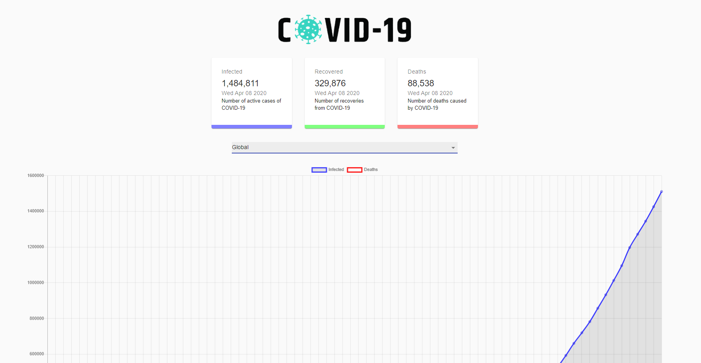

## COVID-19 Tracker

A React based project that displays pertinent and updated information pertaining to the COVID-19 pandemic. The following technologies and libraries were used to create this project:

- React
- Chart.JS for the data charts
- React CountUp for some of the number animations
- MaterialUI
- Axios

API Source: https://github.com/mathdroid/covid-19-api

Hosted on Netlify and can be found <a href="https://xenodochial-bassi-d0c654.netlify.com/" target="_blank">here</a>!

